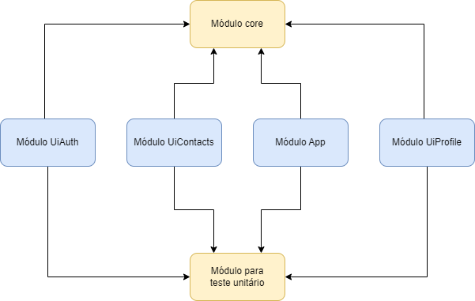
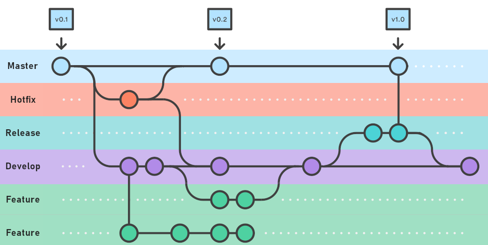

  

  
Projeto de portfólio para o envio de mensagens

  <!--
  -->

## Descrição

Bem-vindo ao meu aplicativo de mensagens! Aqui você poderá enviar e receber mensagens de forma
rápida e fácil. Desfrute de uma experiência de comunicação simples e eficiente em um único
aplicativo. Fique conectado(a) e compartilhe suas mensagens de maneira conveniente com este app
intuitivo e amigável.

## Dependência entre módulos

  

## Encriptar e decriptar o body

Toda requisição que contém body em sua requisição e/ou resposta será encriptado ao sair do device e
decriptado ao chegar do device

### Geração da chave

Processo de geração de chaves para realizar a comunicação com o servidor

  

### Encripta os dados requisição

Processo de encriptação dos dados enviados ao servidor.

  

### Decripta os dados da api

Processo de decriptação dos dados recebidos pelo o servidor.

  

## Esquema das branchs

Aqui é a estrutura das branchs para o repositório.

  

## Tecnologias utilizadas

O app foi desenvolvido usando as seguintes tecnologias:

- LiveData
- ViewModel
- Retrofit
- Dagger
- Navigation
- Coroutines
- Roboletric
- Junit
- MockWebServer
- AndroidExpresso

## Autor

- Author - [Raphael Maracaipe](https://www.linkedin.com/in/raphaelmaracaipe)
